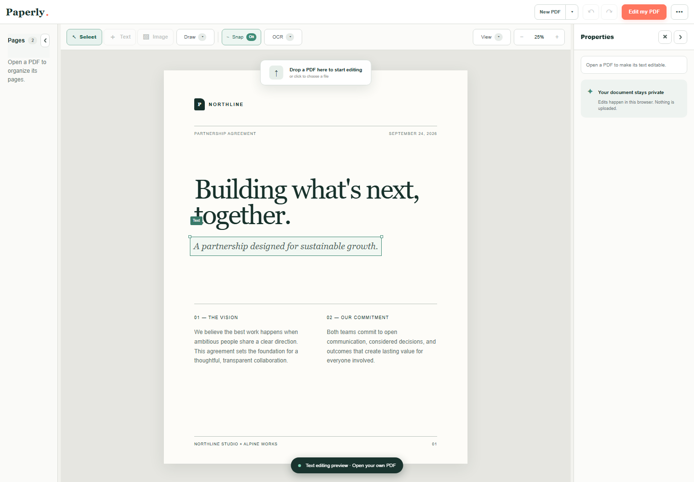

# Paperly

Paperly is a private, local-first PDF editor for the browser and desktop. Edit text, work with forms, manage pages, run OCR, and export your document without sending it to a server.


## See it in action



## Highlights

- Edit PDF text, formatting, images, and vector elements
- Fill and edit AcroForm and XFA form fields
- Add, duplicate, reorder, and delete pages
- Run OCR locally on scanned PDFs
- Undo and redo changes with document sessions
- Export edited PDFs directly from the app
- Use the same editor in the web, portable, and Electron builds

Your document stays on your device during editing. PDF processing, OCR, and export run locally in the browser or desktop app.

## Run locally

Requires Node.js 22.13 or later.

```sh
npm ci
npm run dev
```

Then open the local URL printed by Vite.

Useful checks:

```sh
npm run typecheck
npm run lint
npm run build
npm run test:e2e
```

## Build the desktop apps

```sh
# Standalone portable build
npm run build:portable

# Electron app / Windows installer
npm run electron
npm run build:electron
```

The portable output is written to `portable-build/`. On Windows, launch it with `portable-build/Start Paperly.cmd`. Electron artifacts are written to `electron-dist/`.

## Project structure

```text
app/                    Web entry and global metadata
features/pdf-editor/    Shared client editor, components, hooks, and services
lib/                    XFA template parsing and runtime helpers
portable/               Standalone browser entry and local launcher
electron/               Electron main and preload processes
tests/                  Playwright and editor regression tests
```

The web entry follows Next.js App Router conventions, while the current web toolchain is Vinext on Vite. Portable and Electron import the shared editor directly.

## License

This project is currently private and does not yet include a public license.
